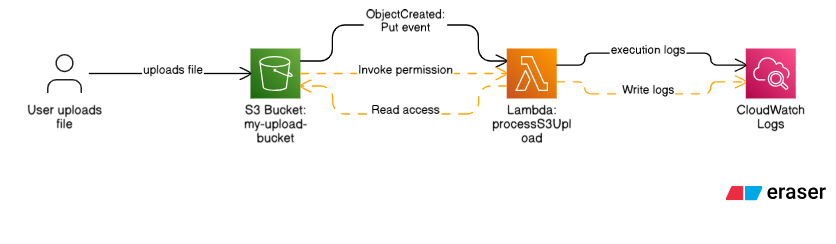

# ⚡ Event-Driven Automation using S3, Lambda & CloudWatch

## 🧠 Concept Overview
This setup demonstrates a serverless automation pipeline where an AWS Lambda function is triggered automatically whenever a file is uploaded to an Amazon S3 bucket.

You don’t have to:
• Run any code manually  
• Manage or maintain servers  

Everything works automatically in response to events — that’s called Event-Driven Architecture.

---

## 🏗️ Workflow
S3 File Upload  →  Lambda Triggered  →  Logs to CloudWatch

---

## ⚙️ Tools & Services Involved

| Service       | Purpose                                                  |
|---------------|----------------------------------------------------------|
| **Amazon S3** | Stores uploaded files and triggers events               |
| **AWS Lambda**| Runs your custom code when triggered                    |
| **IAM**       | Controls permissions and secure access between services |
| **CloudWatch**| Monitors logs and Lambda executions                      |

---

## 🪜 Step-by-Step Implementation

### Step 1: Create a Lambda Function

1. Go to AWS Console → Lambda → Create function  
2. Choose **Author from scratch**  
3. Enter function name:  
   👉 `processS3Upload`  
4. Select Runtime:  
   👉 **Python 3.9** or **Node.js 18**  
5. Under **Permissions** → Change default execution role → **Create a new role with basic Lambda permissions**

Attach the following IAM policies to the role:  
• `AWSLambdaBasicExecutionRole` → allows CloudWatch logging  
• `AmazonS3ReadOnlyAccess` → allows Lambda to read S3 object details

---

### Step 2: Add Lambda Code

**Example (Python):**

```python
import json

def lambda_handler(event, context):
    print("=== FULL EVENT PAYLOAD ===")
    print(json.dumps(event, indent=2))

    for record in event['Records']:
        bucket = record['s3']['bucket']['name']
        key = record['s3']['object']['key']
        size = record['s3']['object']['size']
        print(f"📁 File uploaded: {key} ({size} bytes) in bucket {bucket}")

    return {"status": "processed"}
```

✅ This code logs all **S3 event details** to **CloudWatch Logs**, providing visibility into file uploads and helping in monitoring and debugging.

---

### Step 3: Configure S3 to Trigger the Lambda

1. Go to **S3** → Select your bucket  
2. Click the **Properties** tab  
3. Scroll to **Event notifications** → Click **Create event notification**  
4. Enter name:  
   👉 `triggerLambdaOnUpload`  
5. Under **Event types**, select:  
   ✅ *All object create events*  
6. Under **Destination**, choose:  
   **Lambda function** → `processS3Upload`  
7. Click **Save changes**

✅ AWS automatically updates the **bucket policy** to allow S3 to invoke your Lambda function.

---

## 🪜 Step 4: Upload a File to S3

You can test it manually.

### Option 1 — AWS Console
1. Go to **S3 → Your bucket**
2. Click **Upload**
3. Choose a file (e.g., `test.txt` or `image.jpg`)
4. Click **Upload**

### Option 2 — AWS CLI
```bash
aws s3 cp sample.txt s3://your-bucket-name/
```

✅ Once the file uploads, S3 will automatically send a PUT event to trigger your Lambda.

---
## 🪜 Step 5: Verify CloudWatch Logs

1. Go to **AWS Console → CloudWatch**  
2. In the sidebar, click **Logs → Log groups**  
3. Find your log group:  
   👉 `/aws/lambda/processS3Upload`  
4. Click the latest **Log Stream**

You’ll see entries like:

=== FULL EVENT PAYLOAD ===
{
"Records": [
{
"eventName": "ObjectCreated:Put",
"s3": {
"bucket": {"name": "my-demo-bucket"},
"object": {"key": "sample.txt", "size": 524}
}
}
]
}
📁 File uploaded: sample.txt (524 bytes) in bucket my-demo-bucket

✅ That confirms your setup is working perfectly.

---

## 🔐 Step 6: Configure IAM Roles and Permissions

### A. Lambda Execution Role

Create an IAM Role for Lambda:

1. Go to **IAM → Roles → Create Role**  
2. Select **AWS Service → Lambda → Next**  
3. Attach the following policies:  
   - `AWSLambdaBasicExecutionRole`  
   - `AmazonS3ReadOnlyAccess`  
4. Name it:  
   👉 `lambda-s3-trigger-role`  
5. Assign this role to your Lambda under:  
   **Lambda → Configuration → Permissions**

---

   ### B. Allow S3 to Invoke Lambda

When you add the trigger, AWS automatically adds this policy to your Lambda:

```json
{
  "Effect": "Allow",
  "Principal": { "Service": "s3.amazonaws.com" },
  "Action": "lambda:InvokeFunction",
  "Resource": "arn:aws:lambda:us-east-1:123456789012:function:processS3Upload",
  "Condition": {
    "ArnLike": {
      "AWS:SourceArn": "arn:aws:s3:::my-upload-bucket"
    }
  }
}
```

✅ This ensures only your specific S3 bucket can trigger the Lambda.

---

## 🧩 Security Best Practices

| Recommendation      | Description |
|----------------------|-------------|
| **Least Privilege**  | Grant only the permissions Lambda needs (e.g., `s3:GetObject`, not full S3 access). |
| **No Admin Roles**   | Avoid attaching `AdministratorAccess`. |
| **Log Events**       | Always log the full payload to understand event structure. |
| **Use Resource Policies** | Restrict which S3 bucket can invoke Lambda. |

---

## 🎯 Expected Outcome

Once everything is configured correctly:

| Action | Result |
|--------|---------|
| **Upload file to S3** | S3 generates `ObjectCreated:Put` event |
| **Trigger Lambda** | S3 invokes `processS3Upload` automatically |
| **Log Event** | Lambda logs event details to CloudWatch |

✅ No manual execution needed — everything runs automatically.

---

## 📦 Final Architecture Summary

| Step | Component | Purpose |
|------|------------|----------|
| **1** | Lambda function | Executes code automatically |
| **2** | S3 Trigger (PUT) | Starts the event |
| **3** | CloudWatch Logs | Captures execution logs |
| **4** | IAM Roles | Securely connects S3 ↔ Lambda ↔ CloudWatch |
| **5** | Log Event Payload | Helps debug and analyze automation |

✅ **Outcome:** Lambda auto-executes after file upload.

---
## 🖼️ Architecture Diagram


---

## 🚀 End Result

### Event Flow:
**User Uploads File → S3 Event Trigger → Lambda Function → CloudWatch Logs**

**Automation Verified ✅**

- No servers to manage  
- Fully event-driven  
- Real-time execution  
- Secure and monitored  

---

**-- Jithendarramagiri**

